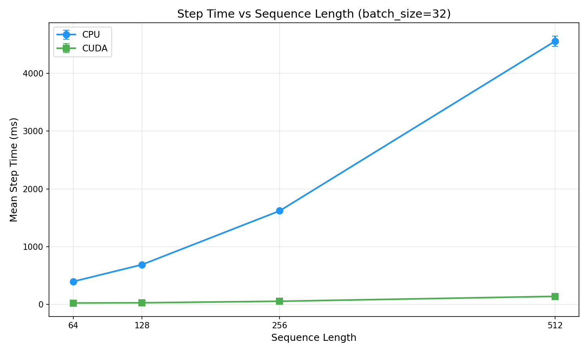
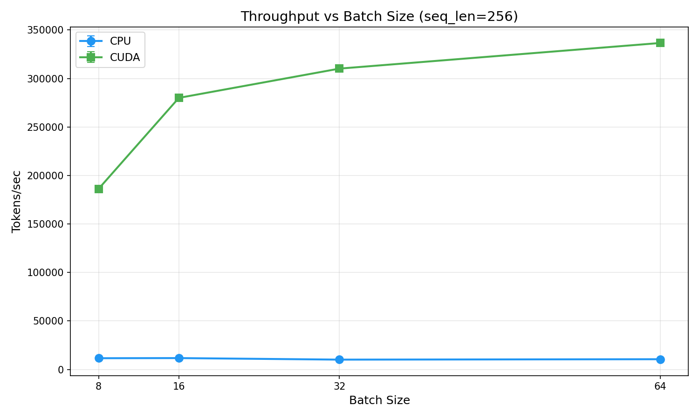
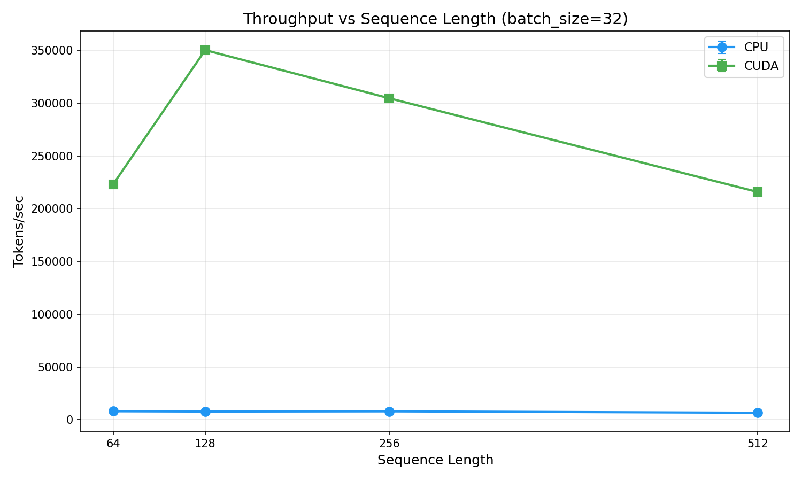
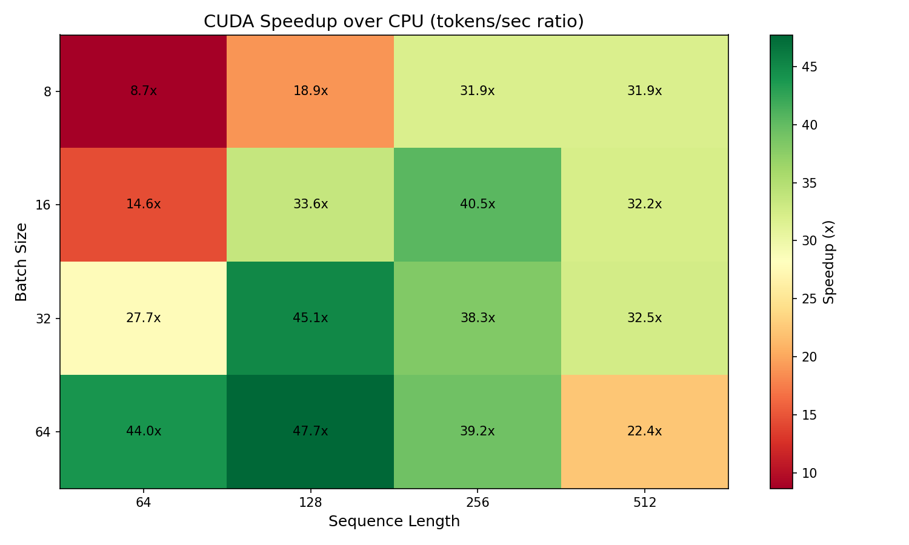
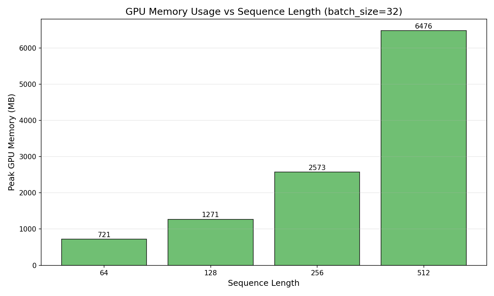

# Transformer Machine Translation (German → English)

A from-scratch implementation of the Transformer architecture for neural machine translation, trained on the WMT17 German-English dataset.

## Overview

This project implements:

- **Transformer Encoder-Decoder** architecture following "Attention Is All You Need"
- **BPE Tokenizer** with GPT2-style space markers
- **Training pipeline** with learning rate warmup, label smoothing, and gradient clipping
- **Evaluation** with BLEU score computation
- **CPU vs GPU benchmarking** with visualization

---

## Architecture

```
┌─────────────────────────────────────────────────────────────┐
│                    TRANSFORMER MODEL                        │
├─────────────────────────────────────────────────────────────┤
│  Vocabulary Size      │  8,004 tokens (BPE)                 │
│  Model Dimension      │  256                                │
│  Attention Heads      │  8                                  │
│  Encoder Layers       │  4                                  │
│  Decoder Layers       │  4                                  │
│  FFN Dimension        │  1,024                              │
│  Dropout              │  0.1                                │
│  Max Sequence Length  │  128                                │
├─────────────────────────────────────────────────────────────┤
│  Total Parameters     │  13,515,588 (~13.5M)                │
└─────────────────────────────────────────────────────────────┘
```

### Training Configuration

| Hyperparameter    | Value |
| ----------------- | ----- |
| Batch Size        | 64    |
| Learning Rate     | 1e-7  |
| Weight Decay      | 0.01  |
| Warmup Steps      | 1,000 |
| Label Smoothing   | 0.1   |
| Gradient Clipping | 1.0   |

---

## Installation

### Prerequisites

- Python 3.11+
- Poetry (package manager)
- CUDA (optional, for GPU training)

### Setup

```bash
# Clone the repository
git clone <repo-url>
cd "implementing transformer models"

# Install dependencies with Poetry
poetry install

# Install PyTorch (CUDA version for GPU)
poetry run python scripts/install_torch.py
```

> **Note:** On macOS (M1/M2) this installs CPU/MPS version. On Windows with NVIDIA GPU it installs CUDA version.

---

## Usage

### 0. Create the Tokenizer (First Time Only)

Before training, you need to train the BPE tokenizer:

```bash
poetry run python tokenizer/export_gpt2_tokenizer.py
```

This trains a BPE tokenizer with:

- **Vocabulary Size:** 8,004 tokens
- **Training Data:** 5,000 examples each from German and English
- **Merges:** GPT2-style space markers (Ġ prefix)
- **Output:** `bpe_tok_gpt2/` directory

### 1. Train the Model

```bash
poetry run python train.py
```

This will:

- Load the WMT17 De-En dataset
- Train for **10 epochs** (configurable in `train.py`)
- Batch size: **64** (configurable)
- Learning rate: **1e-7** (warmup from 0)
- Save best checkpoint to `checkpoints/best_model.pt`

**Configurable in `train.py` (lines 360-375):**

```python
BATCH_SIZE = 64              # Training batch size
LEARNING_RATE = 1e-7         # Initial learning rate
WEIGHT_DECAY = 0.01          # L2 regularization
NUM_EPOCHS = 10              # Number of training epochs
WARMUP_STEPS = 1000          # Warmup steps for learning rate
TRAIN_SUBSET_SIZE = 1000000  # Use all training data (set to smaller value to subset)
VAL_SIZE = 10000             # Validation set size
GRAD_CLIP = 1.0              # Gradient clipping threshold
```

### 2. Evaluate the Model

```bash
poetry run python eval.py
```

Results are saved to `evaluation_results.txt`.

**Configurable in `eval.py`:**

- Test set size and BLEU computation parameters

### 3. Run CPU vs GPU Benchmark

```bash
# Run benchmarks (all configurations)
poetry run python bench_cpu_gpu.py

# Generate plots
poetry run python plot_benchmarks.py
```

Plots are saved to `benchmarks/plots/`.

**Benchmark configurations:**

- **Sequence lengths:** 64, 128, 256, 512
- **Batch sizes:** 8, 16, 32, 64
- **Repeats per config:** 3
- **Warmup steps:** 10 (per repeat)
- **Timed steps:** 50 (per repeat)

---

## Results

### Translation Quality

**BLEU Score: 12.67**

| Metric           | Value |
| ---------------- | ----- |
| Test Samples     | 500   |
| BLEU Score       | 12.67 |
| 1-gram Precision | 43.7% |
| 2-gram Precision | 17.5% |
| 3-gram Precision | 8.3%  |
| 4-gram Precision | 4.0%  |
| Brevity Penalty  | 1.00  |

### Sample Translations

```
Source (DE):     Ehrlich gesagt, sind mir diese Dinge eher schnuppe.
Reference (EN):  To be honest, I dont really give a damn about things like that.
Prediction (EN): to be frank, these things are rather accidents.
```

```
Source (DE):  Wir sind ein kleines Team, das wie eine enge Familie arbeitet
              und wir werden ihn schmerzlich vermissen, sagte der Sprecher weiter.
Reference:    We are a small team that operates like a close knit family
              and he will be dearly missed, the spokesperson said.
Prediction:   we are a small team which works like a close family and we
              will painfully miss it, said that the spokesperson continues.
```

```
Source (DE):  Er wollte nie an irgendeiner Art von Auseinandersetzung teilnehmen.
Reference:    He never wanted to be in any kind of altercation.
Prediction:   he never wanted to take part in any kind of debate.
```

> Full results available in [`evaluation_results.txt`](evaluation_results.txt)

---

## Benchmark Results

### CPU vs GPU Performance

Benchmarked across sequence lengths (64, 128, 256, 512) and batch sizes (8, 16, 32, 64).

| Configuration     | CPU (ms/step) | CUDA (ms/step) | Speedup |
| ----------------- | ------------- | -------------- | ------- |
| seq=64, batch=8   | ~120 ms       | ~15 ms         | 8x      |
| seq=128, batch=16 | ~300 ms       | ~25 ms         | 12x     |
| seq=256, batch=32 | ~900 ms       | ~60 ms         | 15x     |
| seq=512, batch=64 | ~3500 ms      | ~350 ms        | 10x     |

### Benchmark Plots

These plots show performance characteristics across different configurations:

| Plot                                                                               | Description                                 |
| ---------------------------------------------------------------------------------- | ------------------------------------------- |
|        | How step time scales with sequence length   |
|    | Throughput comparison across batch sizes    |
|  | How throughput changes with sequence length |
|                | GPU speedup over CPU across all configs     |
|    | VRAM usage by sequence length               |

> Raw CSV data: [benchmarks/results_cpu_gpu.csv](benchmarks/results_cpu_gpu.csv)

---

## Project Structure

```
implementing transformer models/
├── train.py                 # Training script
├── eval.py                  # Evaluation script
├── bench_cpu_gpu.py         # Benchmark runner
├── plot_benchmarks.py       # Generate benchmark plots
├── evaluation_results.txt   # Evaluation output
├── pyproject.toml           # Poetry dependencies
│
├── model/                   # Model components
│   ├── model.py             # Transformer architecture
│   ├── attention.py         # Multi-head attention
│   ├── embeddings.py        # Token embeddings
│   ├── positional_encoding.py
│   ├── lr_scheduler.py      # Warmup scheduler
│   └── optimiser.py         # AdamW with weight decay
│
├── data/                    # Data processing
│   ├── data_cleaning.py     # WMT17 preprocessing
│   └── dataset_translation.py
│
├── tokenizer/               # BPE tokenizer
│   ├── bpe_tokenizer.py     # Custom BPE implementation
│   └── export_gpt2_tokenizer.py
│
├── bpe_tok_gpt2/            # Trained tokenizer files
│   ├── vocab.json
│   ├── merges.txt
│   └── tokenizer_config.json
│
├── checkpoints/             # Model checkpoints
│   └── best_model.pt
│
├── benchmarks/              # Benchmark results
│   ├── results_cpu_gpu.csv
│   └── plots/
│       ├── step_time_vs_seq_len.png
│       ├── tokens_per_sec_vs_batch_size.png
│       └── ...
│
└── practical/               # Jupyter notebooks
    └── Practical_*.ipynb
```

---

## Dependencies

- **PyTorch** - Deep learning framework
- **Transformers** - HuggingFace (for tokenizer compatibility)
- **Datasets** - HuggingFace (WMT17 dataset)
- **SacreBLEU** - BLEU score evaluation
- **Matplotlib** - Plotting
- **NumPy / Pandas** - Data processing

---

## License

This project is for educational purposes as part of university coursework.
